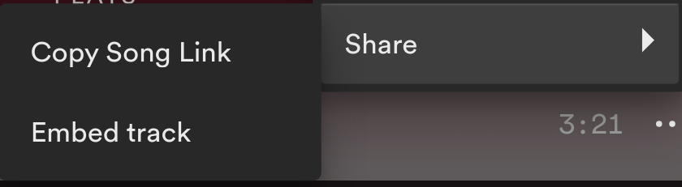

# Spotipy/ffmpeg python script to record a 30 secs song


This python script records a 30 sec song from your computer and downloads the album cover so you can use it to post in your social media e.g. **"whatsapp status"** 📲    
<br/>
Please follow basic instructions from the links provided.
You need to create a developer app from spotify dashboard in order to retrieve data.  
<br/>
Links:
- https://spotipy.readthedocs.io/en/2.19.0/#
- https://developer.spotify.com/dashboard/applications

Tools:
- fmpeg version n5.0
- Python 3.10.4
- GNU Wget 1.21.3
- pulseaudio 15.0
- requirements.txt - python packages

OS:
- Linux **"Arch Linux"**

## Usage:
```code
$ python3 ffmpegImage_plus_Song.py <spotify_song_link>
```

**spotify_song_link** = Copy Song Link




